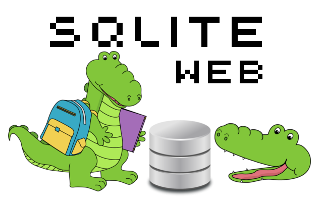

We will start in small steps

Basic database primitives:
- connection
- cursor
- database browser


As visualizer we will use package [`sqlite-web`](https://github.com/coleifer/sqlite-web) wit awesome logo

```python
pip install sqlite-web
```




