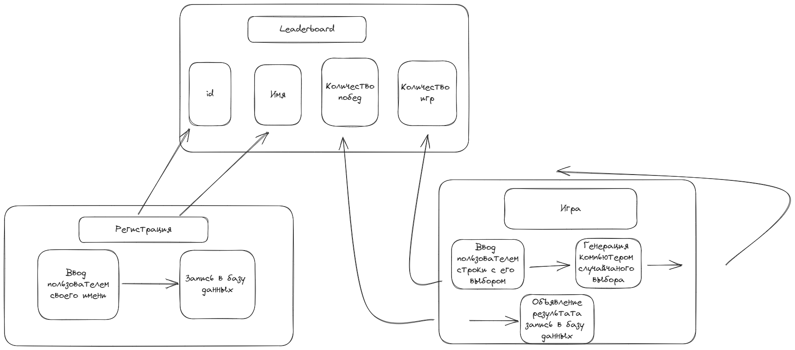

# Rock-Paper-Scissors

We will write simple game Rock-Paper-Scissors from scratch

## Project design:

![]

Every stage will interact with database, so player can compare his results

## Summarization 

## Homework

There is an popular extension of RPS game with introduction two more elements: Spock and Lizard. 

Logic of interaction between new items is described on image below

You'll learn better about mechanics of game via enhancing game with new logic :) 